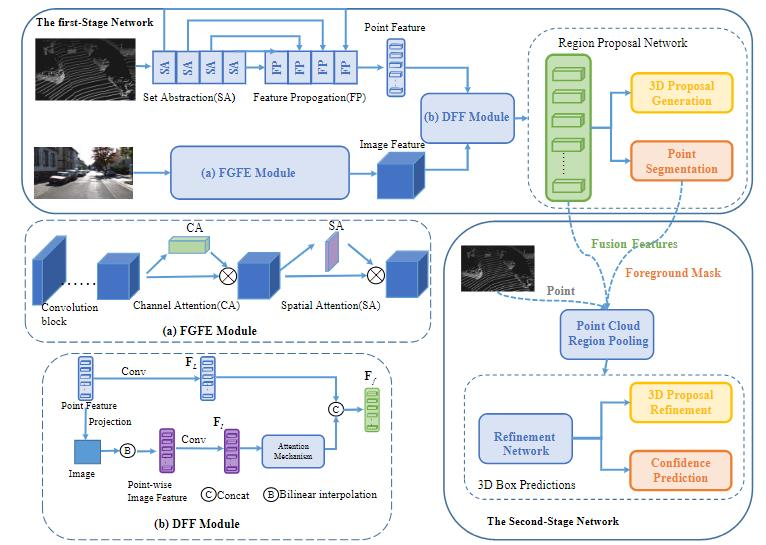
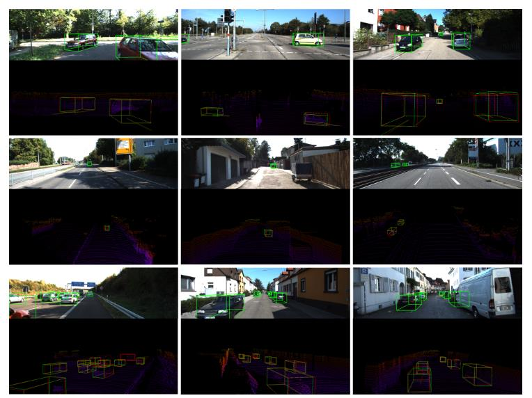

# APIDFF-Net
APIDFF-Net: Adaptive Learning Point Cloud and Image Diversity Feature Fusion Network for 3D Object Detection.

## Abstract
3D object detection is a critical task in the fields of virtual reality and autonomous driving. Given that each sensor has its own strengths and limitations, multi-sensor-based 3D object detection has gained popularity. However, most existing methods extract high-level image semantic features and fuse them with point cloud features, focusing solely on consistent information from both sensors while ignoring their complementary information. In this paper, we present a novel two-stage multi-sensor deep neural network, called the Adaptive Learning Point Cloud and Image Diversity Feature Fusion Network (APIDFF-Net), for 3D object detection. Our approach employs the fine-grained image information to complement the point cloud information by combining low-level image features with high-level point cloud features. Specifically, we design a shallow image feature extraction module to learn fine-grained information from images, instead of relying on deep layer features with coarse-grained information. Furthermore, we design a Diversity Feature Fusion (DFF) module that transforms low-level image features into point-wise image features and explores their complementary features through an attention mechanism, ensuring an effective combination of fine-grained image features and point cloud features. Experiments on the KITTI benchmark show that the proposed method outperforms state-of-the-art methods.

## Network
The overall network architecture.

## Visualization
The overall network architecture.

