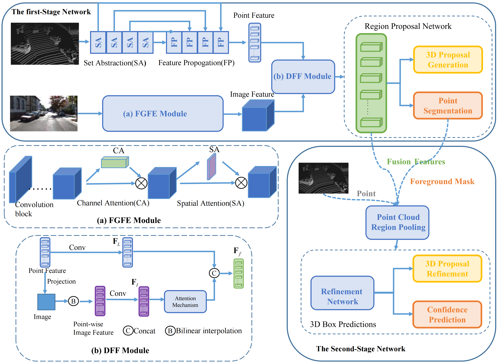

# APIDFF-Net
APIDFF-Net: Adaptive Learning Point Cloud and Image Diversity Feature Fusion Network for 3D Object Detection(Complex & Intelligent Systems 2023).
Paper is now available in [APIDFF-Net](https://link.springer.com/content/pdf/10.1007/s40747-023-01295-x.pdf).


## Abstract
3D object detection is a critical task in the fields of virtual reality and autonomous driving. Given that each sensor has its own strengths and limitations, multi-sensor-based 3D object detection has gained popularity. However, most existing methods extract high-level image semantic features and fuse them with point cloud features, focusing solely on consistent information from both sensors while ignoring their complementary information. In this paper, we present a novel two-stage multi-sensor deep neural network, called the Adaptive Learning Point Cloud and Image Diversity Feature Fusion Network (APIDFF-Net), for 3D object detection. Our approach employs the fine-grained image information to complement the point cloud information by combining low-level image features with high-level point cloud features. Specifically, we design a shallow image feature extraction module to learn fine-grained information from images, instead of relying on deep layer features with coarse-grained information. Furthermore, we design a Diversity Feature Fusion (DFF) module that transforms low-level image features into point-wise image features and explores their complementary features through an attention mechanism, ensuring an effective combination of fine-grained image features and point cloud features. Experiments on the KITTI benchmark show that the proposed method outperforms state-of-the-art methods.

## Network
The overall network architecture.


## Visualization


## Implementation
### Training
```shell
CUDA_VISIBLE_DEVICES=0 python train_rcnn.py --cfg_file cfgs/LI_Fusion_with_attention_use_ce_loss.yaml --batch_size 2 --train_mode rcnn_online --epochs 50 --ckpt_save_interval 1 --output_dir ./log/Car/full_epnet_without_iou_branch/   --set LI_FUSION.ENABLED True LI_FUSION.ADD_Image_Attention True RCNN.POOL_EXTRA_WIDTH 0.2 RPN.SCORE_THRESH 0.2 RCNN.SCORE_THRESH 0.2  USE_IOU_BRANCH False TRAIN.CE_WEIGHT 5.0
```

## Pretrained model
You could download the pretrained model(Car) of APIDFF-Net from [APIDFF-Net](https://pan.baidu.com/s/1RY6nkQ6bUBUofsStHx3ZGQ?pwd=urry) which is trained on the *train* split (3712 samples) and evaluated on the *val* split (3769 samples) and *test* split (7518 samples). The verification set results are located below, and we will place the test set results on the online drive. Anyone can evaluate them through the official KITTI.
```
bbox AP:96.3399, 93.9368, 92.0453
bev  AP:95.7859, 88.9924, 88.7231
3d   AP:92.4268, 82.9832, 80.4240
aos  AP:96.26, 93.49, 91.39
```

```
@InProceedings{Shi_2019_CVPR,
    author = {Shi, Shaoshuai and Wang, Xiaogang and Li, Hongsheng},
    title = {PointRCNN: 3D Object Proposal Generation and Detection From Point Cloud},
    booktitle = {The IEEE Conference on Computer Vision and Pattern Recognition (CVPR)},
    month = {June},
    year = {2019}
}
```

